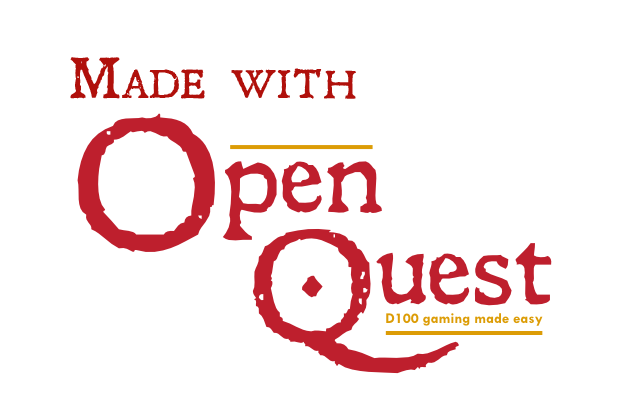

# OQ System

OpenQuest SRD system for Foundry VTT

## Status

Alpha

## Roadmap

v0.1 - Basic character and npc sheets, skill, damage rolls. Skills in compendium.

## Licencing

* Icons: [Game-Icons.net](https://game-icons.net/) - [CC BY 3.0](http://creativecommons.org/licenses/by/3.0/)
* Fonts: Merriweather - [Open Font Licence](https://openfontlicense.org/),
  Leander - [Tension Type Font License v1.00](https://www.fontsquirrel.com/license/leander)
* Game Rules and content: [OpenQuest SRD](https://openquestrpg.com/srd/) by D101
  Games - [Creative Commons](https://creativecommons.org/)
* Foundry VTT: Limited License Agreement for module development.
* Project skeleton: [Foundry Factory](https://github.com/ghost-fvtt/foundry-factory) - [REUSE](https://reuse.software/)
* The rest of the source code: [WTFPL](http://www.wtfpl.net/)

This work is based on the OpenQuest System Resource Document (found at https://openquestrpg.com/srd), a D101 Games
product developed, authored by Newt Newport with Paul Mitchener. OpenQuest System Resource Document © 2021 by Newt
Newport with Paul Mitchener is licensed under Attribution 4.0 International. To view a copy of this license,
visit http://creativecommons.org/licenses/by/4.0/

OpenQuest is the trademark of Paul Newport, used with Permission.

## Install

Put below link into 'Manifest URL' field.

https://github.com/michalzc/oq-system/releases/latest/download/system.json
