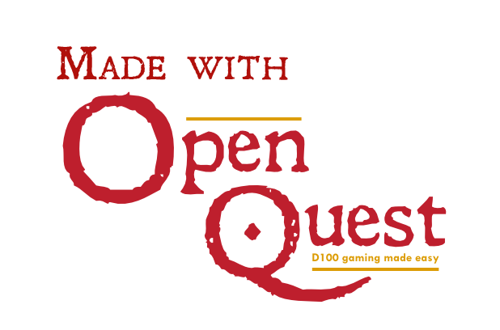

# OQ System

OpenQuest SRD system for Foundry VTT

## Status

Beta

## Development

Use `nix develop` for Node 22, Yarn, and the `start-foundry` helper. Install dependencies with
`yarn install --frozen-lockfile`, then run `yarn build` with Foundry stopped to create `build/`, including compendia.
Point `foundryvtt-data/Data/systems/oq` at this repository's `build/` directory (update any existing link to `dist/`).

Start Foundry with `start-foundry`, then run `yarn dev` in another terminal and open `http://localhost:32000`.
This watches code, Less styles, YAML metadata, and public assets. Refresh the browser after a rebuild;
there is no development proxy or automatic page reload. `yarn build:watch` is an alias for the same watcher.

- `yarn build:packs`: replace generated compendia in `build/packs/` from `src/packs/`.
- `yarn build:code`: bundle JavaScript, compile Less, convert metadata to JSON, and copy public assets to `build/`.
- `yarn build`: run both steps in order.
- `yarn clean`: remove generated `build/` and legacy `dist/` output.

Code builds and watch mode preserve existing compendium databases. After changing `src/packs/`, stop
Foundry, run `yarn build:packs`, then restart Foundry. A browser refresh does not reopen Foundry's databases.
Also stop Foundry and the watcher before running `yarn clean`. Code builds do not remove obsolete output files;
use `yarn clean && yarn build` for a fresh distribution after removing or renaming sources.
Restart the watcher after adding new public assets or language files.

Run `yarn test`, `yarn lint`, and `yarn build` before submitting changes. Lint checks JavaScript, Less,
and Handlebars syntax and markup.

## Contributors

[tuirgin](https://github.com/tuirgin) - SRD Bestiary as journal pages.

## Roadmap

* v0.6 - Support for V14
* ~~v0.5 - https://github.com/michalzc/oq-system/issues/138 - Support for V13~~ **Done**
* ~~v0.5 - https://github.com/michalzc/oq-system/milestone/5. Quality of life improvements.~~ _Postponed_
* ~~v0.4 - Update to FoundryVTT V12~~ **Done**
* ~~v0.3 - https://github.com/michalzc/oq-system/milestone/3. SRD content (without bestiary) in compendiums and few QoL features.~~ **Done**
* ~~v0.2 - https://github.com/michalzc/oq-system/milestone/2.~~ **Done**
* ~~v0.1 - Basic character and npc sheets, skill, damage rolls. Skills in compendium.~~ **Done**

## Licencing

* Icons: [Game-Icons.net](https://game-icons.net/) - [CC BY 3.0](http://creativecommons.org/licenses/by/3.0/)
* Fonts: Merriweather - [Open Font Licence](https://openfontlicense.org/),
  Leander - [Tension Type Font License v1.00](https://www.fontsquirrel.com/license/leander)
* Game Rules and content: [OpenQuest SRD](https://openquestrpg.com/srd/) by D101
  Games - [Creative Commons](https://creativecommons.org/)
* Foundry VTT: Limited License Agreement for module development.
* Project skeleton: [Foundry Factory](https://github.com/ghost-fvtt/foundry-factory) - [REUSE](https://reuse.software/)
* The rest of the source code: [WTFPL](http://www.wtfpl.net/)

This work is based on the OpenQuest System Resource Document (found at https://openquestrpg.com/srd), a D101 Games
product developed, authored by Newt Newport with Paul Mitchener. OpenQuest System Resource Document © 2021 by Newt
Newport with Paul Mitchener is licensed under Attribution 4.0 International. To view a copy of this license,
visit http://creativecommons.org/licenses/by/4.0/

OpenQuest is the trademark of Paul Newport, used with Permission.

## Install

Put below link into 'Manifest URL' field.

https://github.com/michalzc/oq-system/releases/latest/download/system.json

