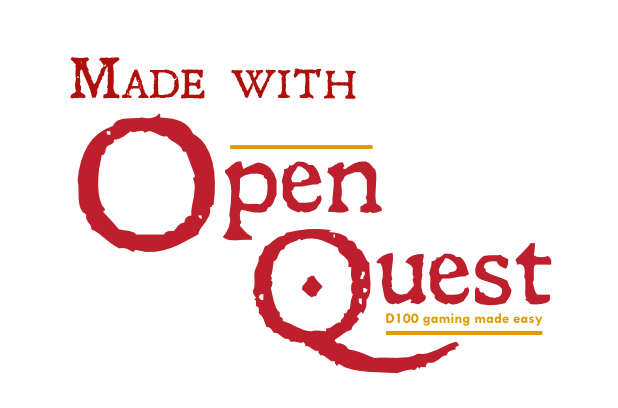

# OQ System

OpenQuest SRD system for Foundry VTT

## Status

Beta. The current development version requires Foundry VTT 14 and is verified on 14.368.
Both actor sheets, all six item sheets, the dialogs and the combat tracker use ApplicationV2.
Sheets and dialogs retain the light parchment theme. See [issues.md](issues.md) for the migration review
and completed combat tracker redesign.

## Contributors

[tuirgin](https://github.com/tuirgin) - SRD Bestiary as journal pages.

## Roadmap

Issue numbers refer to the [GitHub tracker](https://github.com/michalzc/oq-system/issues).

### v0.7 — Release the v14 / ApplicationV2 work

The AppV2 sheets and dialogs, the new combat tracker and the pack cleanup are merged but not yet released
(`v0.6.0` contains only the v14 compatibility pass).

* Release v0.7.0.
* Release workflow: update the deprecated actions (`checkout`, `setup-node`) and replace the archived
  `microsoft/variable-substitution` step — [#29](https://github.com/michalzc/oq-system/issues/29).
* Optional: publish releases to the Foundry package registry from the release workflow —
  [#68](https://github.com/michalzc/oq-system/issues/68).
* Tracker cleanup:
  * Verify and close [#47](https://github.com/michalzc/oq-system/issues/47) (context menu) and
    [#104](https://github.com/michalzc/oq-system/issues/104) (icons by item subtype).
  * Close the v0.5 milestone; move its open issues to the milestones below.
  ~~* Move `issues.md` to `docs/` as the migration record.~~ **Done**

### v0.8 — Magic and quality of life

* Spell casting dialog: roll the referenced casting skill, deduct MP by magnitude, post a chat card —
  [#94](https://github.com/michalzc/oq-system/issues/94).
* Custom spell type — [#110](https://github.com/michalzc/oq-system/issues/110).
* Item sheet option to add an item to new characters / NPCs, instead of editing `flags.oq.newActor` by hand —
  [#121](https://github.com/michalzc/oq-system/issues/121).
* Documentation compendium updated for the new sheets and combat flow —
  [#61](https://github.com/michalzc/oq-system/issues/61).

### v0.9 — Buffs and Active Effects

* Temporary HP / MP above the maximum, independent of Active Effects —
  [#124](https://github.com/michalzc/oq-system/issues/124).
* Active Effects support — [#14](https://github.com/michalzc/oq-system/issues/14):
  * decide which fields effects may change;
  * fix the data preparation order: base data, effects, derived values;
  * effects tab on actor and item sheets, effects transferred from items.
* Statuses with OpenQuest conditions — [#109](https://github.com/michalzc/oq-system/issues/109).
* Enchanted items: magic point stores and stored spells — [#96](https://github.com/michalzc/oq-system/issues/96).

### v1.0 — Content and polish

* SRD creatures as NPC actors in a compendium, generated from the bestiary journal into YAML packs —
  [#11](https://github.com/michalzc/oq-system/issues/11), [#118](https://github.com/michalzc/oq-system/issues/118).
* Dark theme for sheets and dialogs (deferred in the migration, C8).
* Unit tests for actor and item data preparation.

### Later

* Token Action HUD support, probably as a separate module — [#56](https://github.com/michalzc/oq-system/issues/56).
* Combat automation — [#10](https://github.com/michalzc/oq-system/issues/10).

### Completed

* ~~v0.6 - Foundry VTT V14 support~~ **Done**
* ~~v0.5 - https://github.com/michalzc/oq-system/issues/138 - Support for V13~~ **Done**
* ~~v0.5 - https://github.com/michalzc/oq-system/milestone/5. Quality of life improvements.~~ _Postponed_
* ~~v0.4 - Update to FoundryVTT V12~~ **Done**
* ~~v0.3 - https://github.com/michalzc/oq-system/milestone/3. SRD content (without bestiary) in compendiums and few QoL features.~~ **Done**
* ~~v0.2 - https://github.com/michalzc/oq-system/milestone/2.~~ **Done**
* ~~v0.1 - Basic character and npc sheets, skill, damage rolls. Skills in compendium.~~ **Done**

## Licencing

* Icons: [Game-Icons.net](https://game-icons.net/) - [CC BY 3.0](http://creativecommons.org/licenses/by/3.0/)
* Fonts: Merriweather - [Open Font Licence](https://openfontlicense.org/),
  Leander - [Tension Type Font License v1.00](https://www.fontsquirrel.com/license/leander)
* Game Rules and content: [OpenQuest SRD](https://openquestrpg.com/srd/) by D101
  Games - [Creative Commons](https://creativecommons.org/)
* Foundry VTT: Limited License Agreement for module development.
* Project skeleton: [Foundry Factory](https://github.com/ghost-fvtt/foundry-factory) - [REUSE](https://reuse.software/)
* The rest of the source code: [WTFPL](http://www.wtfpl.net/)

This work is based on the OpenQuest System Resource Document (found at https://openquestrpg.com/srd), a D101 Games
product developed, authored by Newt Newport with Paul Mitchener. OpenQuest System Resource Document © 2021 by Newt
Newport with Paul Mitchener is licensed under Attribution 4.0 International. To view a copy of this license,
visit http://creativecommons.org/licenses/by/4.0/



OpenQuest is the trademark of Paul Newport, used with Permission.

## Install

Put below link into 'Manifest URL' field.

https://github.com/michalzc/oq-system/releases/latest/download/system.json

## Combat

Each encounter begins with **Round 1 — Declaration**, with no active turn. Choose an action and a signed integer
initiative modifier in the tracker or actor sheet. Available actions are skills and special abilities with roll
formulas; initiative uses their value plus the declaration modifier. Players can edit actors they own, and the GM
can edit every participant. These choices persist as actor-sheet defaults.

The GM clicks **Start round** to freeze each declaration, sort initiative from highest to lowest and begin turns.
Changing the actor sheet afterwards affects the next declaration phase. Declarations record intent; they do not
restrict actions or apply modifiers to subsequent skill rolls. A blank or deleted selection uses only the modifier.

Ending the last eligible turn opens the next declaration phase automatically. The GM's **Next round** also opens
that phase. **Previous turn** stays within the running round. Late participants wait until the next round, and
Foundry's defeated-participant setting still applies. Start round is disabled when no eligible participant remains.
A connected GM and Foundry's **Query Users** permission are required for player tracker edits and turn advancement.

## Development

Building the system needs only Node.js (`^20.19` or `>=22.12`; Node.js 24 is recommended) and Yarn 1.
Running Foundry VTT 14.368 also requires Node.js 24 (24.13.1 or later).
Nix is optional: the [Nix environment](#nix-environment-optional) below adds pinned tooling, a packaged
Foundry VTT and one-command launchers, but nothing in the build depends on it.

```sh
yarn install --frozen-lockfile
yarn build
```

To use the build in Foundry VTT 14, stop Foundry, then copy or symlink `build/` as `Data/systems/oq`
in your Foundry data directory and start Foundry. With a symlink, run `yarn dev` to rebuild code and assets
when sources change, and refresh the browser after each rebuild.

- `yarn build:packs`: replace generated compendia in `build/packs/` from `src/packs/`.
- `yarn build:code`: bundle JavaScript, compile Less, convert metadata to JSON, and copy public assets to `build/`.
- `yarn build`: run both steps in order.
- `yarn dev` (alias `yarn build:watch`): rebuild code, Less styles, YAML metadata, and public assets on change.
- `yarn clean`: remove generated `build/` and legacy `dist/` output.

Code builds and watch mode preserve existing compendium databases. After changing `src/packs/`, stop
Foundry, run `yarn build:packs`, then restart Foundry. A browser refresh does not reopen Foundry's databases.
Also stop Foundry and the watcher before running `yarn clean`. Code builds do not remove obsolete output files;
use `yarn clean && yarn build` for a fresh distribution after removing or renaming sources.
Restart the watcher after adding new public assets or language files.

Run `yarn test`, `yarn lint`, and `yarn build` before submitting changes. Lint checks JavaScript, Less,
and Handlebars syntax and markup.

### Nix environment (optional)

The project uses the shared [foundry-dev](https://github.com/michalzc/foundry-dev) flake,
pinned in `flake.lock`. `flake.nix` owns the Foundry 14.368 archive hash and Node.js 24 selection;
Yarn uses the same Node.js version. Download your licensed Node.js archive, name it
`FoundryVTT-14.368.zip`, and import it before entering the shell:

```sh
nix-store --add-fixed sha256 FoundryVTT-14.368.zip
direnv allow
# Or without direnv:
nix develop
```

With direnv configured, entering the checkout loads the tools into the current shell. Run `direnv reload`
after changing the flake if needed. Without direnv, use `nix develop --command zsh` for an interactive zsh shell.

Install Chromium on the host, then run:

```sh
yarn install --frozen-lockfile
start-dev
# Rebuild code and assets when sources change:
start-dev --watch
# Or without entering the development shell:
nix run .#start-dev -- --watch
```

The launcher builds the system, links `build/` into `foundryvtt-data/Data/systems/oq`, starts Foundry
on port 32000, creates or reuses the `oq-dev` world, and opens its join screen in Chromium.
Select the GM/user in the browser. Stop any Foundry instance using this checkout's build before launching;
the initial build replaces compendium databases. Existing worlds are preserved and checked for the `oq` system.
Use a separate data directory when switching Foundry major versions: a world created or opened by Foundry 14
cannot be launched by Foundry 13. Set `FOUNDRY_DATA_PATH` to choose another data directory.

`--watch` runs `yarn dev` after startup, watching code, Less styles, YAML metadata, and public assets.
Refresh the browser after a rebuild; there is no automatic page reload. Ctrl+C or closing Chromium stops
the processes started by the launcher.

`start-dev` defaults to the `oq-dev` world and `foundryvtt-data` at the Git checkout root,
including from subdirectories. Use `FOUNDRY_WORLD`, `FOUNDRY_PORT`, and `FOUNDRY_DATA_PATH` to override these
defaults. Relative data overrides for `start-dev` resolve against the Git root. Both build and watch use
the packaged Yarn with Node.js 24, including when invoked through `nix run` outside the shell.

Chromium uses the ignored `.dev/chromium` profile and exposes remote debugging on loopback port 9222,
compatible with Chrome DevTools MCP at `http://127.0.0.1:9222`. The launcher discovers `chromium` or
`chromium-browser` on PATH; override this with `CHROMIUM_BIN`. Use `CHROMIUM_DEBUG_PORT` to change the debugging
port and update the MCP endpoint accordingly. Occupied Foundry or debugging ports cause startup to fail.

On first use, enter the Foundry license and accept its terms in Chromium if requested. If the data directory
requires administrator authentication, set `FOUNDRY_ADMIN_PASSWORD` and optionally `FOUNDRY_ADMIN_USERNAME`,
or create and launch `oq-dev` manually in Chromium when prompted. Player login remains interactive.

For manual startup, build with `yarn build` while Foundry is stopped and link
`foundryvtt-data/Data/systems/oq` to this checkout's `build/` directory. Run `start-foundry` for the setup screen,
or `FOUNDRY_WORLD=oq-dev start-foundry` for an existing world, then run `yarn dev` in another terminal.
Outside the shell, use `FOUNDRY_WORLD=oq-dev nix run .#start-foundry`. This launcher also accepts
`FOUNDRY_PORT` and `FOUNDRY_DATA_PATH`; relative data overrides resolve against the current directory.
Extra command-line arguments are forwarded to Foundry.

The development environment uses Foundry 14.368; the system manifest sets both the minimum and verified
compatible version to 14.

Entering the shell exports `FOUNDRY_APP_PATH` and refreshes the ignored `foundryvtt-api`
symlink for editor navigation. Existing real files or directories at that path are preserved.
The `foundry` shell alias is available. The `foundryvtt` package provides the pinned Foundry 14.368 build;
the legacy `foundryvtt-13` package alias currently points to that same build.

Run `nix flake update foundry-dev` to upgrade the shared environment, then commit
`flake.lock`. This does not change the project's Foundry version or archive hash.
Format the flake with `nix fmt -- flake.nix`. To try the sibling shared checkout without
changing the committed input or lock file:

```sh
nix develop --override-input foundry-dev path:../foundry-dev --no-write-lock-file
```